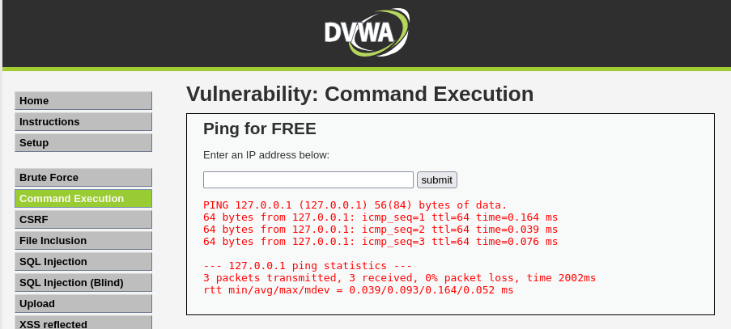
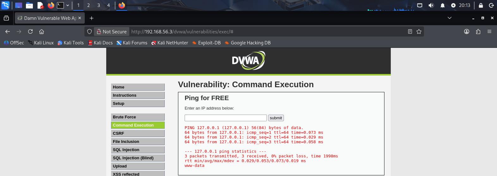

# DVWA Command Injection Lab

## 📌 Project Overview

This project demonstrates a Command Injection vulnerability in DVWA (Damn Vulnerable Web Application) running in a controlled lab environment.

Environment:
- Kali Linux
- Metasploitable 2
- DVWA
- VirtualBox
- Security Level: Low

---

## 🔎 Vulnerability Details

- Vulnerability Type: OS Command Injection
- Endpoint: /dvwa/vulnerabilities/exec/
- Method: POST
- Parameter: IP address input

---

## 🧪 Proof of Concept

Normal input:

127.0.0.1

Injected input:

127.0.0.1; whoami

Result:

The application executed both commands and returned:

www-data

This confirms that user input is passed directly into a system command without proper validation.

---
## 📸 Screenshots

### Normal Ping

### Command Injection

---
## ⚠️ Impact

An attacker could:

- Execute arbitrary system commands
- Read sensitive files
- Escalate privileges (depending on configuration)
- Gain full system compromise

---

## 🛡️ Remediation

To prevent Command Injection:

- Never concatenate user input into system commands
- Use parameterized command execution
- Validate and whitelist input (IP format only)
- Run applications with least privilege

---

## ⚖️ Legal Disclaimer

This project was conducted in a controlled lab environment using DVWA.
No real systems were targeted.
